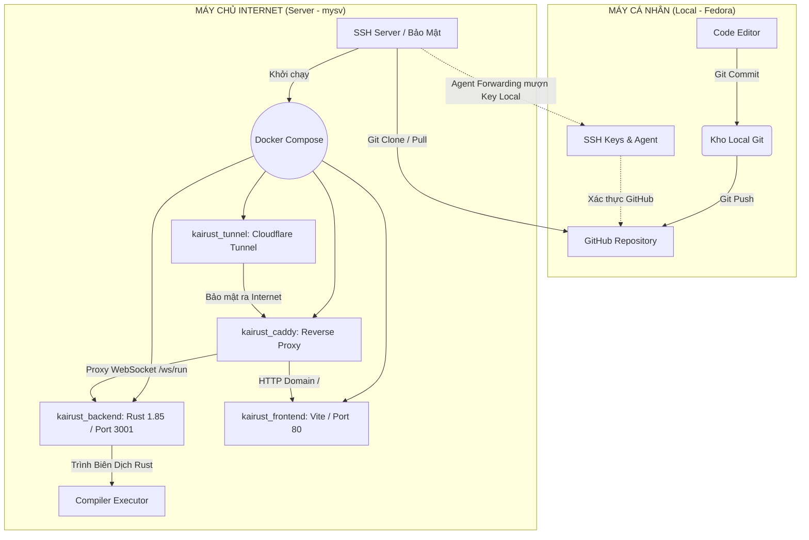

## 1. SƠ ĐỒ KIẾN TRÚC & LUỒNG TRIỂN KHAI

Sơ đồ mô tả quy trình đẩy code từ máy cá nhân lên server thông qua SSH Agent Forwarding và cấu trúc của hệ thống Docker trên Server.

---

Đây là bản viết lại tổng hợp từ cách LeetCode, HackerRank và Codeforces mô tả hệ thống của họ:
2. FORMAT BÀI TẬP

Mỗi bài tập được cấu trúc theo các trường sau:

    title: Tiêu đề hiển thị trong danh sách bài tập (ví dụ: "Bài tập 2.1: Tạo biến String")
    problemTitle: Tên bài toán ngắn gọn, hiển thị làm tiêu đề chính của trang (ví dụ: "Tạo biến String")
    problemDescription: Đề bài chi tiết mô tả yêu cầu bài toán. Nên viết rõ ràng, đủ điều kiện để người dùng hiểu mà không cần đọc phần hướng dẫn (ví dụ: "Khai báo biến guess kiểu String, gán giá trị 'test', in ra màn hình")
    inputFormat: Mô tả định dạng dữ liệu đầu vào theo từng dòng. Nếu bài không có input, ghi rõ "Không có input" (ví dụ: "Dòng 1: số nguyên n (1 ≤ n ≤ 10⁶)")
    outputFormat: Mô tả định dạng kết quả đầu ra mong đợi, bao gồm số dòng và kiểu dữ liệu (ví dụ: "In ra một dòng duy nhất: test")
    examples: Danh sách ví dụ minh họa công khai. Mỗi ví dụ gồm input, output và explanation giải thích từng bước tại sao ra kết quả đó. Đây là các test case được hiển thị cho người dùng thấy.
    constraints: Danh sách các ràng buộc của bài toán như giới hạn giá trị, kiểu dữ liệu bắt buộc, điều kiện đặc biệt (ví dụ: "Phải sử dụng kiểu String, không dùng &str")
    content: Nội dung lý thuyết và hướng dẫn liên quan, định dạng Markdown, hiển thị ở panel bên trái. Phần này giải thích khái niệm cần dùng để giải bài, không phải lời giải.
    defaultCode: Code khung có sẵn trong editor khi người dùng mở bài. Dùng comment // TODO: để đánh dấu vị trí cần điền code.
    testCases: Danh sách tất cả test case dùng để chấm bài, bao gồm cả test công khai lẫn test ẩn. Mỗi test case gồm input (stdin), expectedOutput (kết quả chuẩn sau khi trim whitespace) và description (mô tả ngắn mục đích test). Toàn bộ test case này đều được chạy khi nộp bài.

3. QUY TRÌNH CHẤM BÀI KHI NỘP

Khi người dùng nhấn Nộp bài, hệ thống thực hiện tuần tự các bước sau:

Bước 1 — Tiếp nhận submission: Frontend gửi WebSocket message lên backend gồm code (nội dung editor), lesson_id (ID bài tập) và is_test: true.

Bước 2 — Chuẩn bị môi trường: Backend tạo thư mục workspace tạm riêng biệt cho mỗi lần nộp, ghi code vào src/main.rs và tạo Cargo.toml với dependency rand được cấu hình sẵn.

Bước 3 — Biên dịch: Chạy cargo build --release. Nếu có lỗi compile, trả về thông báo lỗi ngay lập tức, bỏ qua các bước sau.

Bước 4 — Chạy toàn bộ test case: Với mỗi test case trong testCases, backend chạy binary với input làm stdin, áp dụng giới hạn thời gian thực thi (time limit). Output từng dòng được stream về frontend qua WebSocket trong thời gian thực.

Bước 5 — Đối chiếu kết quả: Sau khi nhận tín hiệu kết thúc (exit), frontend so sánh output thực tế với expectedOutput của từng test case (sau khi trim whitespace cả hai chiều). Bài được coi là Accepted khi tất cả test case đều khớp.

Bước 6 — Trả kết quả: Hiển thị trạng thái từng test case (passed/failed), số test case vượt qua trên tổng số, và với test case sai sẽ hiển thị diff giữa expected output và actual output để người dùng dễ debug.

