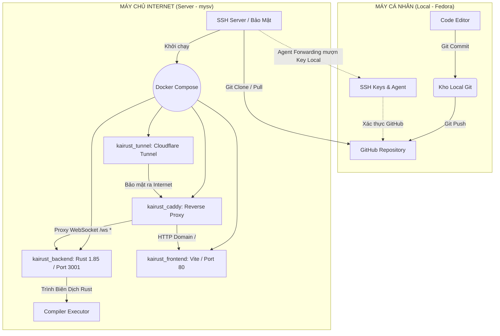

## 1. SƠ ĐỒ KIẾN TRÚC & LUỒNG TRIỂN KHAI

Sơ đồ mô tả quy trình đẩy code từ máy cá nhân lên server thông qua SSH Agent Forwarding và cấu trúc của hệ thống Docker trên Server.



---

## 2. EXPLAIN CHI TIẾT TỪNG BƯỚC VÀ DÒNG LỆNH ĐÃ CHẠY

Dưới đây là thứ tự công việc và tất cả các dòng lệnh đã được thực thi từ Local lên Server:

### Giai đoạn 1: Chuẩn bị tại máy cá nhân (Fedora Local)

**1. Sửa IP Web Socket trong source code**
*   *Thao tác:* Đổi url WebSocket trong file cấu hình `.ts` của Frontend từ Localhost sang địa chỉ Production Server. Vì môi trường Production dùng Reverse Proxy bằng Caddy, Frontend phải gọi `wss://kairust.duckdns.org/ws` (hoặc cấu hình gốc).
*   *Lệnh Commit:*
    ```bash
    git add .
    git commit -m "Cập nhật WebSocket URL cho Production deploy"
    git push origin main
    ```
    *Giải thích:* Đưa mọi thay đổi vào khu vực chờ (staging), ghi lại lịch sử bản cập nhật (commit) và đẩy bản tin Git vừa thay đổi lên nhánh main trên kho GitHub trung tâm.

**2. Thiết Lập Khóa SSH Mới Bậc Cao (Ed25519)**
*   *Lệnh:*
    ```bash
    ssh-keygen -t ed25519 -C "quanvu@example.com"
    ```
    *Giải thích:* `ssh-keygen` tạo cặp khóa "Ổ Khóa Công Khai" (Public Key) và "Chìa Khóa Riêng Tư" (Private Key). Giao thức `ed25519` là phương thức mã hóa siêu nhanh và bảo mật hiện đại nhất, vượt trội hơn RSA cũ. Tham số `-C` là comment để đánh dấu email của bạn cho khóa này. Kết quả sẽ tạo ra 2 file: `id_ed25519` và `id_ed25519.pub`.

**3. Đẩy Khóa Công Khai Lên Server mysv**
*   *Lệnh:*
    ```bash
    ssh-copy-id username@IP_Server
    ```
    *Giải thích:* Lệnh này là một script tự động hóa việc đọc nội dung trong file `id_ed25519.pub` ở máy bạn, và chèn vào tệp tin bảo mật `~/.ssh/authorized_keys` nằm bên trong Server đích. Từ nay trở đi bạn có thể SSH (đăng nhập) không cần mã pin hay password.

**4. Thiết lập Alias và Agent Forwarding trong `~/.ssh/config`**
*   *Thao tác:* Mở file config `nano ~/.ssh/config` trên máy Fedora và lưu cấu hình:
    ```text
    Host mysv
        HostName IP_Server
        User username
        IdentityFile ~/.ssh/id_ed25519
        ForwardAgent yes
    ```
*   *Lệnh phân quyền bảo vệ:*
    ```bash
    chmod 700 ~/.ssh
    chmod 600 ~/.ssh/config
    ```
    *Giải thích lệnh `chmod` (Change Mode):* Cơ chế SSH rất khắt khe về việc "Ai có thể nắm được khóa của bạn". `chmod 700` yêu cầu thư mục `.ssh` chỉ có đúng tài khoản cá nhân của con người tạo lập là được Quyền Đọc+Ghi+Khởi chạy, các người dùng hay app khác bị Cấm xâm phạm. Tương tự `chmod 600` chặn Quyền Đọc từ bất kỳ Users lạ đối với File Config SSH. Nếu bạn không chạy lệnh này, chương trình SSH sẽ văng báo lỗi ngắt kết nối do "Unprotected private key file".
*   *Giải thích tính năng `ForwardAgent yes`:* Lệnh tối quan trọng để máy chủ Ảo mượn chìa khoá `id_ed25519` bằng cách truyền "thần giao cách cảm" thông qua đường hầm SSH. Nhờ đó, máy chủ Ảo dù không có File Private key nhưng vẫn mạo danh tải được dự án từ Github riêng tư.

**5. Khởi động Agent và Nạp Định Danh Bằng Mật Khẩu (Nếu có)**
*   *Lệnh:*
    ```bash
    eval "$(ssh-agent -s)"
    ssh-add ~/.ssh/id_ed25519
    ```
    *Giải thích:* Mở bộ trình ngầm chạy nền background trên Fedora là `ssh-agent`, sau đó mang Chìa khoá nạp thẳng vào bộ xử lý bộ nhớ. Nó giống như thủ tục nhét chìa khóa vào két sắt để bạn gõ Passphrase 1 lần duy nhất trong toàn phiên làm việc của bạn.

### Giai đoạn 2: Lệnh Điều khiển trên Không gian máy chủ (Server mysv)

**6. Xâm nhập Server có kích hoạt Điệp Viên (Agent Forwarding)**
*   *Lệnh:*
    ```bash
    ssh -A mysv
    ```
    *Giải thích:* Cờ `-A` dùng để kích hoạt Forward Agent bằng tay cho chắc chắn. Gọi tới `mysv` (chữ viết tắt do file `~/.ssh/config` cấu hình sẵn Alias từ trước).

**7. Test Kết Nối Giữa Server và Github (Thử mượn Key Local)**
*   *Lệnh:*
    ```bash
    ssh -T git@github.com
    ```
    *Giải thích:* Lệnh kiểm toán bảo mật kinh điển. Nếu Server báo lỗi "Permission Denied", tức là Agent Forwarding hỏng! Nếu kết nối đúng, Github sẽ trả lời "Hi HiImKaii! You've successfully authenticated". Ở đây tài khoản luôn mặc định là `git` vì Github chỉ có 1 tài khoản trung gian này để hứng SSH session.

**8. Kéo Dự án Private bằng Giao thức SSH nguyên mẫu**
*   *Lệnh:*
    ```bash
    git clone git@github.com:HiImKaii/KaiRust.git
    cd KaiRust
    ```
    *Giải thích:* Bắt mồi thông qua SSH (chứ không phải `https://github...`), tải toàn bộ cây thư mục KaiRust mà không cần phải thiết lập Personal Access Token lằng nhằng. Vị trí tải nằm đúng tại `/home/username/KaiRust/`.

**9. Cấu hình biến môi trường và chuẩn bị Docker**
*   *Thao tác:* Cài Docker + Docker Compose lên Ubuntu Server Linux. Sau đó, viết file `.env` chứa token cho Cloudflare Tunnel và Domain (ví dụ `DOMAIN=kairust.duckdns.org` và cấu hình token cho DuckDNS nếu caddy không fetch được chứng chỉ bảo mật).

**10. Xây Dựng & Giành Chỗ Trống Cho Máy Ảo Docker Compose**
*   *Lệnh dọn dẹp (Làm tuỳ chọn để giải tỏa RAM):*
    ```bash
    docker system prune -f
    ```
    *Giải thích:* `-f` (force) Dọn mọi bộ nhớ đệm cache, các Images cũ kỹ ngầm định đang chiếm không gian ổ cứng (đặc biệt khi hệ thống Rust Target compile cực tốn Storage).
*   *Lệnh Thần Thánh Cốt Lõi (Docker Compose):*
    ```bash
    docker-compose up -d --build
    ```
    *Giải thích:* Đọc cấu trúc từ `docker-compose.yml`. Dấu cờ `--build` rà soát toàn bộ thay đổi ở `backend/Dockerfile` và `frontend/Dockerfile` để làm mẻ build App mới tinh với Rust 1.85. Cờ `-d` (Detached) yêu cầu Docker tách các container đó ra chạy ẩn sâu trong OS. Bạn có thể thoát cửa sổ gõ lệnh mà Server (Vite port 80 proxy và Rust port 3001) vẫn sống 100%.

**11. Caddy Reverse Proxy & Giám sát**
*   *Quá trình Caddy:* Sau khi docker boot xong caddy, container cấu hình `kairust_caddy` có gắn Caddyfile tự động đọc yêu cầu từ cổng 8080 (cổng kết nối mà Tunnel gõ cổng vào bên trong từ mạng ngoài CloudFlare) để chia nhánh luồng. HTTP/HTTPS giao diện tĩnh HTML/CSS quẳng cho frontend, các tín hiệu gọi WebSocket `wss://.../ws` gửi cho backend chạy lệnh Rust do bạn Code Game.
*   *Lệnh giám sát cuối:*
    ```bash
    docker ps
    docker-compose logs -f
    ```
    *Giải thích:* Xác nhận 4 container (Tunnel, Caddy, Backend, Frontend) đã Up khỏe mạnh và đu theo dòng Stream thời gian thực bắt lỗi Console (stdout/stderr).