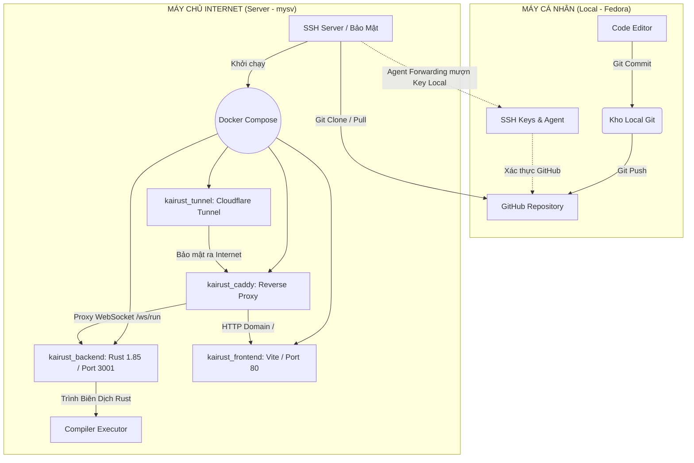

## 1. SƠ ĐỒ KIẾN TRÚC & LUỒNG TRIỂN KHAI

Sơ đồ mô tả quy trình đẩy code từ máy cá nhân lên server thông qua SSH Agent Forwarding và cấu trúc của hệ thống Docker trên Server.



---

## 2. EXPLAIN CHI TIẾT TỪNG BƯỚC

Dưới đây là thứ tự công việc và tất cả các dòng lệnh đã được thực thi từ Local lên Server:

### Giai đoạn 1: Chuẩn bị tại máy cá nhân (Fedora Local)

**1. Cơ chế Web Socket tự động (Thông tin cập nhật)**
*   *Thao tác:* Ở góc độ hệ thống hiện tại, file `main.ts` cấu hình Frontend đã được thiết kế để tự động nhận dạng giao thức động `(window.location.protocol === 'https:' ? 'wss://' : 'ws://') + window.location.host + '/ws/run'`. Thay vì phải chỉnh tay một URL như `kairust.duckdns.org` lúc triển khai, mã nguồn giờ đã linh hoạt hoàn toàn giữa Local và Production.
*   *Quản lý phiên bản:* Việc này giúp bạn không cần phát sinh một commit thừa chỉ để đổi địa chỉ IP trên máy chủ. Mọi định hướng lưu lượng sẽ được Caddy phân luồng và đẩy vào Backend.

**2. Thiết Lập Khóa SSH Mới Bậc Cao (Ed25519)**
*   *Lệnh:*
    ```bash
    ssh-keygen -t ed25519 -C "quanvu@example.com"
    ```
    *Giải thích:* `ssh-keygen` tạo cặp khóa "Ổ Khóa Công Khai" (Public Key) và "Chìa Khóa Riêng Tư" (Private Key). Giao thức `ed25519` là phương thức mã hóa siêu nhanh và bảo mật hiện đại nhất, vượt trội hơn RSA cũ. Tham số `-C` là comment để đánh dấu email của bạn cho khóa này. Kết quả sẽ tạo ra 2 file: `id_ed25519` và `id_ed25519.pub`.

**3. Đẩy Khóa Công Khai Lên Server mysv**
*   *Lệnh:*
    ```bash
    ssh-copy-id username@IP_Server
    ```
    *Giải thích:* Lệnh này là một script tự động hóa việc đọc nội dung trong file `id_ed25519.pub` ở máy bạn, và chèn vào tệp tin bảo mật `~/.ssh/authorized_keys` nằm bên trong Server đích. Từ nay trở đi bạn có thể SSH (đăng nhập) không cần mã pin hay password.

**4. Thiết lập Alias và Agent Forwarding trong `~/.ssh/config`**
*   *Thao tác:* Mở file config `nano ~/.ssh/config` trên máy Fedora và lưu cấu hình:
    ```text
    Host mysv
        HostName IP_Server
        User username
        IdentityFile ~/.ssh/id_ed25519
        ForwardAgent yes
    ```
*   *Lệnh phân quyền bảo vệ:*
    ```bash
    chmod 700 ~/.ssh
    chmod 600 ~/.ssh/config
    ```
    *Giải thích lệnh `chmod` (Change Mode):* Cơ chế SSH rất khắt khe về việc "Ai có thể nắm được khóa của bạn". `chmod 700` yêu cầu thư mục `.ssh` chỉ có đúng tài khoản cá nhân của con người tạo lập là được Quyền Đọc+Ghi+Khởi chạy, các người dùng hay app khác bị Cấm xâm phạm. Tương tự `chmod 600` chặn Quyền Đọc từ bất kỳ Users lạ đối với File Config SSH. Nếu bạn không chạy lệnh này, chương trình SSH sẽ văng báo lỗi ngắt kết nối do "Unprotected private key file".
*   *Giải thích tính năng `ForwardAgent yes`:* Lệnh tối quan trọng để máy chủ Ảo mượn chìa khoá `id_ed25519` bằng cách truyền "thần giao cách cảm" thông qua đường hầm SSH. Nhờ đó, máy chủ Ảo dù không có File Private key nhưng vẫn mạo danh tải được dự án từ Github riêng tư.

**5. Khởi động Agent và Nạp Định Danh Bằng Mật Khẩu (Nếu có)**
*   *Lệnh:*
    ```bash
    eval "$(ssh-agent -s)"
    ssh-add ~/.ssh/id_ed25519
    ```
    *Giải thích:* Mở bộ trình ngầm chạy nền background trên Fedora là `ssh-agent`, sau đó mang Chìa khoá nạp thẳng vào bộ xử lý bộ nhớ. Nó giống như thủ tục nhét chìa khóa vào két sắt để bạn gõ Passphrase 1 lần duy nhất trong toàn phiên làm việc của bạn.

### Giai đoạn 2: Lệnh Điều khiển trên Không gian máy chủ (Server mysv)

**6. Xâm nhập Server có kích hoạt Điệp Viên (Agent Forwarding)**
*   *Lệnh:*
    ```bash
    ssh -A mysv
    ```
    *Giải thích:* Cờ `-A` dùng để kích hoạt Forward Agent bằng tay cho chắc chắn. Gọi tới `mysv` (chữ viết tắt do file `~/.ssh/config` cấu hình sẵn Alias từ trước).

**7. Test Kết Nối Giữa Server và Github (Thử mượn Key Local)**
*   *Lệnh:*
    ```bash
    ssh -T git@github.com
    ```
    *Giải thích:* Lệnh kiểm toán bảo mật kinh điển. Nếu Server báo lỗi "Permission Denied", tức là Agent Forwarding hỏng! Nếu kết nối đúng, Github sẽ trả lời "Hi HiImKaii! You've successfully authenticated". Ở đây tài khoản luôn mặc định là `git` vì Github chỉ có 1 tài khoản trung gian này để hứng SSH session.

**8. Kéo Dự án Private bằng Giao thức SSH nguyên mẫu**
*   *Lệnh:*
    ```bash
    git clone git@github.com:HiImKaii/KaiRust.git
    cd KaiRust
    ```
    *Giải thích:* Bắt mồi thông qua SSH (chứ không phải `https://github...`), tải toàn bộ cây thư mục KaiRust mà không cần phải thiết lập Personal Access Token lằng nhằng. Vị trí tải nằm đúng tại `/home/username/KaiRust/`.

**9. Cấu hình biến môi trường và chuẩn bị Docker**
*   *Thao tác:* Cài Docker + Docker Compose lên Ubuntu Server Linux. Sau đó, viết file `.env` chứa token cho Cloudflare Tunnel và Domain (ví dụ `DOMAIN=kairust.duckdns.org` và cấu hình token cho DuckDNS nếu caddy không fetch được chứng chỉ bảo mật).

**10. Xây Dựng & Giành Chỗ Trống Cho Máy Ảo Docker Compose**
*   *Lệnh dọn dẹp (Làm tuỳ chọn để giải tỏa RAM):*
    ```bash
    docker system prune -f
    ```
    *Giải thích:* `-f` (force) Dọn mọi bộ nhớ đệm cache, các Images cũ kỹ ngầm định đang chiếm không gian ổ cứng (đặc biệt khi hệ thống Rust Target compile cực tốn Storage).
*   *Lệnh Thần Thánh Cốt Lõi (Docker Compose):*
    ```bash
    docker-compose up -d --build
    ```
    *Giải thích:* Đọc cấu trúc từ `docker-compose.yml`. Dấu cờ `--build` rà soát toàn bộ thay đổi ở `backend/Dockerfile` và `frontend/Dockerfile` để làm mẻ build App mới tinh với Rust 1.85. Cờ `-d` (Detached) yêu cầu Docker tách các container đó ra chạy ẩn sâu trong OS. Bạn có thể thoát cửa sổ gõ lệnh mà Server (Vite port 80 proxy và Rust port 3001) vẫn sống 100%.

**11. Caddy Reverse Proxy & Giám sát**
*   *Quá trình Caddy:* Sau khi docker boot xong caddy, container cấu hình `kairust_caddy` có gắn Caddyfile tự động đọc yêu cầu từ cổng 8080 (cổng kết nối mà Tunnel gõ cổng vào bên trong từ mạng ngoài CloudFlare) để chia nhánh luồng. HTTP/HTTPS giao diện tĩnh HTML/CSS quẳng cho frontend, các tín hiệu gọi WebSocket `wss://.../ws` gửi cho backend chạy lệnh Rust do bạn Code Game.
*   *Lệnh giám sát cuối:*
    ```bash
    docker ps
    docker-compose logs -f
    ```
    *Giải thích:* Xác nhận 4 container (Tunnel, Caddy, Backend, Frontend) đã Up khỏe mạnh và đu theo dòng Stream thời gian thực bắt lỗi Console (stdout/stderr).
## Tính năng giao diện Phân loại Khóa học
Hệ thống tự động phát hiện bài học là **Lý thuyết** hay **Thực hành** để điều chỉnh giao diện:
- **Lý thuyết**: Cho phép chạy mã tự do, có chế độ nhập luồng dữ liệu chuẩn (STDIN) trực tiếp từ Terminal để tương tác với chương trình. Nút nộp bài tự động ẩn đi.
- **Thực hành**: Khóa tính năng STDIN tại Terminal, yêu cầu sinh viên phải đưa dòng code tự xử lý thuật toán. Ấn "Nộp bài" để kích hoạt đối chiếu chéo (Cross-check). Cơ chế Backend (Rust Sandbox) sẽ bí mật nhúng đoạn test module theo `lesson_id` (tại `src/exercises/<lesson_id>.rs`) nối vào mã của học sinh, tiến hành compile ở chế độ Unit Test bằng cờ lệnh `rustc --test`. Qua đó, tính minh bạch và độ chính xác của bài làm được đo lường 100%.

---

## 3. PHẦN BỔ SUNG: ÁP DỤNG KIẾN THỨC MẠNG & DEVOPS CĂN BẢNVÀO DỰ ÁN KAIRUST

Để đáp ứng quá trình học tập thực tế trên Server Linux, dưới đây là phần giải thích chi tiết tuyệt đối của các lệnh và khái niệm tương đồng với kiến thức vận hành hệ thống:

### 3.1) Kiến thức SSH (Secure Shell)
SSH là ứng dụng thường dùng để đăng nhập (login) bảo mật vào màn hình Terminal của máy tính từ xa. 
Các lệnh vận hành trong quá trình xây dựng KaiRust liên quan tới SSH:

- **Tạo cặp khoá SSH cá nhân**
  ```bash
  ssh-keygen -t ed25519 -C "quanvu@example.com"
  ```
  - `ssh-keygen`: Viết tắt của "SSH Key Generator" - chương trình sinh khoá mã hoá.
  - `-t ed25519`: Cờ `-t` (type) chọn thuật toán mã hoá. `ed25519` là hệ mật mã đường cong elliptic rất an toàn và tính toán nhanh, bảo mật hơn RSA cũ.
  - `-C "quanvu@example.com"`: Cờ `-C` (comment) để đánh dấu/ghi chú thích tên người tạo (thường dùng email). Chìa khóa riêng tư (`id_ed25519`) cất ở máy bạn, còn khóa công khai (`id_ed25519.pub`) sẽ phát cho người khác.

- **Đưa khoá công khai lên Server đích**
  ```bash
  ssh-copy-id username@IP_Server
  ```
  - Lệnh này là một bộ script rút gọn giúp bạn đọc file `~/.ssh/id_ed25519.pub` ở máy gốc và chèn (append) nội dung đó vào file `/home/username/.ssh/authorized_keys` của máy chủ.
  - Tác dụng: Server sẽ nhận diện được "chìa khóa công khai" của bạn.Từ nay bạn gõ `ssh username@IP_Server` là vào thẳng máy chủ, cấm hoàn toàn (`PasswordAuthentication no`) việc dùng mật khẩu để trị dứt điểm Brute Force Attack.

- **Đổi quyền bảo vệ file Config SSH**
  Trong Linux, nếu ai lạ mặt vào đọc được Private Key, bạn sẽ mất toàn bộ Server. Do đó chương trình SSH ép buộc người dùng phân quyền bằng `chmod` (Change Mode):
  ```bash
  chmod 700 ~/.ssh
  chmod 600 ~/.ssh/config
  ```
  - `700`: Phân quyền dạng số học hệ 8 (Octal). `7` = `4` (Read - Đọc) + `2` (Write - Ghi) + `1` (Execute - Khởi chạy lệnh/Mở thư mục). Con số `7` đứng đầu cấp toàn quyền cho đúng 1 người: Bạn. Hai số `00` cấm tất cả người cùng nhóm và khách vãng lai. Thư mục `.ssh` phải như vậy.
  - `600`: `6` = `4` (Đọc) + `2` (Ghi). File `config` chỉ là text, không phải ứng dụng để chạy nên không cần cộng thêm bộ số `1`. Chỉ có bạn mới có Quyền Đọc + Ghi đè vào file này.

- **Mở khoá kết nối trung gian (SSH Agent Forwarding)**
  ```bash
  eval "$(ssh-agent -s)"
  ssh-add ~/.ssh/id_ed25519
  ssh -A mysv
  ```
  - `ssh-agent`: Một chương trình điệp viên mật mã chạy lặn (background) lưu giữ các khoá Private Key đã được giải mã mật khẩu (Passphrase).
  - `eval`: Ra lệnh cho Terminal tự động chèn kết quả của ssh-agent (các biến môi trường như `$SSH_AUTH_SOCK`) vào trạng thái phiên làm việc hiện tại.
  - `ssh-add`: Tải Private key của bạn vào tay "điệp viên" này.
  - `ssh -A mysv`: Cờ `-A` là "Agent Forwarding". Nó cho phép một luồng thần giao cách cảm. Máy chủ `mysv` có thể đóng vai làm cái bóng của máy bạn, trực tiếp tải Source Code từ Github qua đường hầm SSH mà Github tưởng nhầm rằng đó là máy cá nhân của bạn gọi yêu cầu.

- *(Chưa làm ở KaiRust)* **Đường hầm rẽ mạng proxy (SSH Dynamic Port Forwarding)**
  ```bash
  ssh -D 3210 username@IP_Server
  ```
  - Cờ `-D` (Dynamic port forwarding): Tạo ra một cổng Socket cục bộ ở Port `3210` trên máy cá nhân. Bất cứ ứng dụng nào (chẳng hạn Firefox, Chrome) thiết lập mạng chuyển qua cổng cục bộ (127.0.0.1:3210) đều sẽ bị điều hướng mã hoá xuyên qua mạng vào tới Server rồi phi ra môi trường Web quốc tế. Kết quả: Mạng của trình duyệt Firefox sẽ mang định danh IP của Server ở Tokyo hay Mỹ, dù bạn đang ngồi Việt Nam.

### 3.2) Kiến thức Tường Lửa Netfilter (Iptables)
Linux mặc định sờ vào tầng lõi nhân mã nguồn bằng `netfilter` để thao tác trực tiếp luồng gói tin đến/đi (packets). Công cụ ra lệnh cho Netfilter là `iptables`. Cấu trúc của tường lửa này như sau:

- **Giám sát bảng Iptables:**
  ```bash
  sudo iptables --list -n -v
  sudo iptables -t nat --list -n -v
  ```
  - `--list`: Yêu cầu dàn trải tất cả các luồng quy tắc phân luồng.
  - `-n` (numeric): Cấm Iptables không dùng DNS dịch địa chỉ IP thành tên miền làm chậm mạng, chỉ hiển thị số IP thô.
  - `-v` (verbose): Hiển thị siêu chi tiết lượng gói tin (packets) và byte dung lượng đi qua cổng đó.
  - `-t nat`: Hiển thị "Network Address Translation" (chuyên phân giải và chui luồng đổi địa chỉ bên trong IP giả cục bộ - IP thật internet). Có cấu trúc: `PREROUTING` (Khi khách lạ vào trước) và `POSTROUTING` (Trả khách về mạng).

- **Hành động Mở Cổng Tường Lửa (Port 443 và Port 80):**
  ```bash
  iptables -A INPUT -p tcp --dport 443 -j ACCEPT
  ```
  - `-A INPUT`: (Append) Thêm một luật chặn đuôi vào dải dây chuyền đường vào `INPUT` của máy tính.
  - `-p tcp`: (Protocol) Quy định chỉ bắt đúng giao thức TCP (cho lướt web).
  - `--dport 443`: (Destination Port) Chặn gói tin có đích đến là Căn phòng số 443 (quy định cứng của HTTPS). Với cổng HTTP web thường là số `80`.
  - `-j ACCEPT`: (Jump to target) Sau khi đọc luồng trúng điều kiện, Gán kết quả: Đồng ý mở cửa! Nếu thay bằng `-j DROP` đồng nghĩa vứt gói tin đó đi (cấm luôn).

- **Hành động Cấm Đoán Triệt Để (Thiết lập Policy):**
  ```bash
  iptables -P INPUT DROP
  ```
  - `-P INPUT`: (Policy) Thiết lập luật mặc định cho toàn bộ luồng vào thành `DROP`. Cực kỳ bảo mật và cực kỳ rủi ro: Nếu gõ lệnh này mà chưa có bất kỳ lệnh -A INPUT mở khóa SSH (Port `22`) nào từ trước, chính bản thân bạn sẽ bị hệ thống Linux hất văng ra Internet khỏi máy chủ và vĩnh viễn không thể điều khiển được phần cứng (trừ khi khởi động lại cấu hình cứng).

### 3.3) HTTPS Web Server (Caddy/Nginx Reserve Proxy)
Trình phục vụ Web (Web server) của bạn được gắn trên cổng `80` hoặc `443` để cấp phát dữ liệu tĩnh HTML và HTTPS SSL Encryption. Bạn không dùng Nginx, mà dùng thế hệ Caddy thông minh hơn ngàn lần:

- **Hệ thống phân luồng máy chủ (Reverse Proxy):**
  - Khái niệm Proxy trong bài tập yêu cầu chuyển tiếp (VD: nginx nhận cổng 8080 để gửi vào trong). Ở KaiRust, nếu có khách truy cập bằng `https://kairust.duckdns.org`, dữ liệu sẽ va vào vùng đệm *Reserve Proxy* của công cụ Caddy.
  - Nếu đường link chỉ mưu cầu lướt Web thô (HTML/CSS), Caddy nối ống dẫn trực tiếp vào Container `kairust_frontend` đứng ở đằng sau cửa ngõ để trả file tĩnh.
  - Nếu đường link phát tiếng gọi giao thức Web Socket là `wss://.../ws/run`, Caddy "trích luồng" (route data) nhét thẳng vào Container `kairust_backend` đang nghe lén ngầm định tại cổng Rust siêu kín Port `3001` (Cổng 3001 này không hề mở công khai ngoài iptables mà chỉ có Caddy với Docker mới biết).

- **Thiết lập Chứng Chỉ HTTPS Sinh Trưởng Tự Động (Chứng Thực Số)**
  - Theo bài giảng, bạn phải tự tay ký File OpenSSL giả với độ dài khóa bí mật RSA 2048bit: `openssl req -new -newkey rsa:2048 -nodes -keyout ssl.key -out ssl.csr`. Điều này tạo ra hai tập tin vật lý ở định dạng CSR Request và KEY để làm giả mạo khóa Tự ký.
  - Trong KaiRust, Server tự gánh toàn bộ thông qua DuckDNS. Nhờ Token Cloudflare/DuckDNS, module Caddy sẽ tự động "thuyết phục" máy chủ định danh quốc tế cấp phát một luồng File Crt siêu bảo mật qua Module ACME Challenge, sau đó khóa luồng người dùng bắt buộc `Redirect` truy cập trên Port 80 về Port 443 hoàn toàn tự động.

### 3.4) Làm việc với Docker, Docker Compose
Docker là một "Cảng Biển" cung cấp các "Thùng Contaier". Chạy tiến trình trong Contaier như bật một môi trường Linux nằm ngầm bên trong cái Linux gốc, giữ server của bạn hoàn toàn sạch sẽ, dọn dẹp không để lại bộ nhớ rác.

- **Các khái niệm tạo dựng:**
  - `Image`: Đây là bản đúc lõi cố định để khởi nguồn Contaier. Nó chứa bộ khung Hệ điều hành tí hon + Source code (Vite hoặc Rust). Để tạc ra Image, bạn phải viết `Dockerfile` trong thư mục code. File này chứa chuỗi khai báo từ trên xuống: Tải nền OS Linux Ubuntu, Copy source code, Chạy lệnh Compile code tạo file thi hành...
  - `Container`: Khi Image (Bản khắc cứng) được `Run` thì nó hoá thân thành Container (Thực thể đang sống). Bạn có thể xoá bỏ, tắt mở thoải mái Container mà không sợ ảnh hưởng tới bản gốc Image.
  - `Port mapping`: Giữa thế giới Internet với thực thể ảo Contaier đang bị bịt kín. Bạn dùng cú pháp `ports: "80:80"`. Số bên trái là cổng mạng của Server gốc (bám vào card mạng thật). Số bên phải là cổng mở khoá cho Không gian Ảo container.
  - `Volumes`/`Mount point`: Trong Docker, khi tiến trình Contaier bị tàn lụi, những file bị ghi đè sẽ bay màu theo (Giống việc reboot đóng băng quán net). Việc sử dụng Mount (Ví dụ: `./Caddyfile:/etc/caddy/Caddyfile`) cho phép nhét cứng chiếc File cấu hình ở Server Thật cắm thẳng vào máy ảo Docker. Máy con đọc File đó như thể nó đang tồn tại nhưng bản chất nó nằm ngoài vỏ của máy thật (Mount Point). Khi máy con sập file cấu hình bạn viết ra ngoài vỏ máy không hề bị mất mát.

- **Orchestration bằng Docker Compose (Dàn nhạc giao hưởng):**
  - Để dựng 4 cái Image (Backend, Frontend, Cloudflare tunnel, Caddy), bạn phải gõ lại chuỗi dòng lệnh `docker run` khoảng 40 lần.
  - `docker-compose up -d --build` giải quyết bài toán đó. Đọc cấu trúc từ YAML, Docker Compose tự khởi tạo ra một "Network Card Mạng Ảo", sau đó kết nối các Contaier liên kết nhau qua chữ cái `depends_on`.
  - Cờ `--build` (Re-Build) tái lập lại bộ khung Image sau mỗi lần mã nguồn Source code thay đổi.
  - Cờ `-d` (Detached mode) ném bộ sậu Contaier đó vào bóng tối (Chạy nền - Background Service) trả lại cho bạn con trỏ chuột gõ lệnh trên màn Terminal để làm việc khác.

**LỜI KẾT:** Nếu bạn nhìn vào một hệ thống phần mềm, một dòng thư mục `KaiRust` của bạn là minh chứng sống động, bao hàm từ Network Linux, SSH, Web Security đến Hệ phân luồng cấp cao trong Docker.
